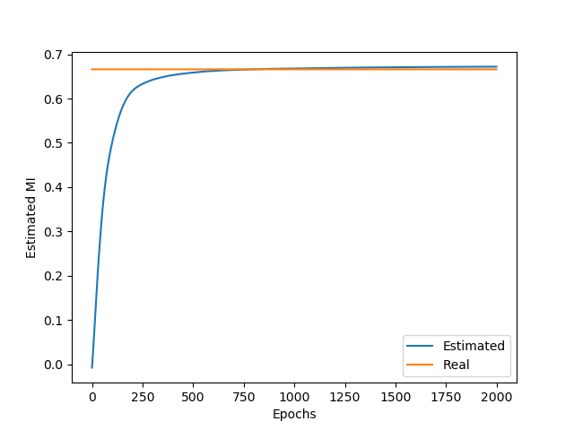

This is a Pytorch implementation of the [*Mutual Information Neural Estimator*](https://arxiv.org/abs/1801.04062). 

## Installation

To install `cd` to the directory of the repository and run `pip install -e .`

## Usage

The file `example.py` contains a simple usage example where the mutual information between two correlated gaussian variables is estimated. To run the example `cd` to the directory of the repository and run `python example.py`. You should see something like this:

